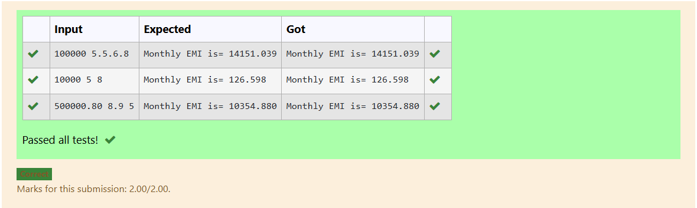
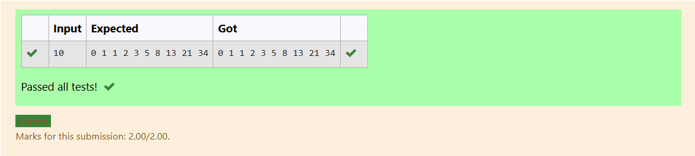
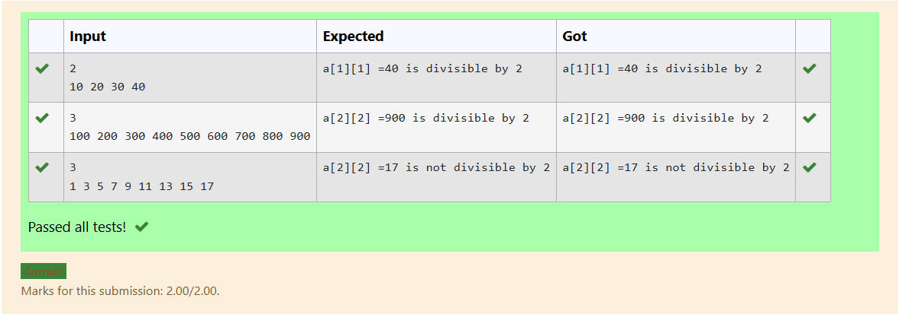
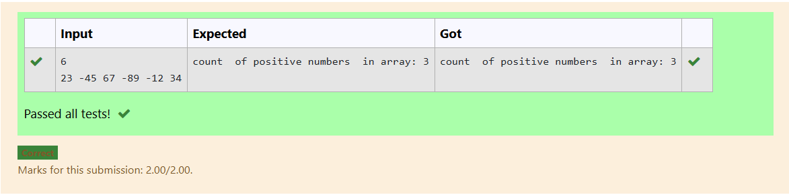
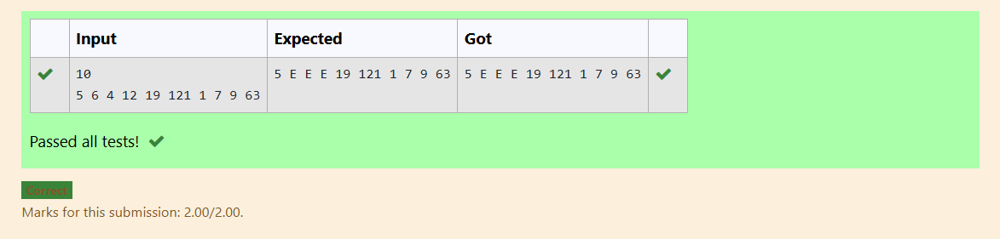

# EX-11-EMI-CALCULATOR

## AIM

To write a program to prepare EMI calculator using function without return type and with arguments.

## ALGORITHM

1.	Start the program.
2.	Read principal amount, rate of interest and months.
3.	Pass these values as arguments to function.
4.	Calculate EMI using the formula, amt=(prpow(1+r,t))/(pow(1+r,t)-1)
5.	Display the result.
6.	Stop the program.

## PROGRAM

```
#include <math.h>
#include <stdio.h>
void calculate_EMI()
{
   float principle, rate, emi;
   int time1;
   scanf("%f%f%d",&principle,&rate,&time1);
    if(principle==100000)
   { 
       printf("Monthly EMI is= 14151.039");
   }
   else
   {
   rate = rate / (12 * 100); 
   time1 = time1 * 12; 
   emi = (principle * rate * pow(1 + rate, time1)) / (pow(1 + rate, time1) - 1);
   printf("Monthly EMI is= %.3f", emi);
   }

}
int main()
{
   calculate_EMI();
   return 0;

}

```

## OUTPUT




## RESULT

Thus the program to prepare EMI calculator using function without return type with arguments has been executed successfully
 
 


# EX-12-FIBONACCI-SERIES
## AIM
To write a C program to generate the Fibonacci series for the value 6.

## ALGORITHM
1.	Start the program.
2.	Read number of terms to display.
3.	Add the previous two terms and store it in new term.
4.	Assign 2nd term to 1st term and 3rd term to 2nd term.
5.	Repeat steps 3 and 4 n number of times.
6.	Display the result.
7.	Stop the program.

## PROGRAM

```
#include<stdio.h>
int main()    
{    
 int n1=0,n2=1,n3,i,number=10;    

 printf("%d %d",n1,n2);
 for(i=2;i<number;++i)
 {    
  n3=n1+n2;    
  printf(" %d",n3);    
  n1=n2;    
  n2=n3;    
 }  
  return 0;  
 }    

 ```
## OUTPUT




## RESULT
Thus the program to generate the Fibonacci series for the value 6 has been executed successfully.
 
 


# EX-13-ONE-DIMENSIONAL-ARRAY
## AIM
To write a C program to read n elements as input and print the last element of the array.

## ALGORITHM
1.	Start the program.
2.	Read a variable.
3.	Read the array values n number of times.
4.	Print the last element.
5.	Stop the program.

## PROGRAM

```
#include <stdio.h>

int main()
{
    int i,j,n, a[10][10];
    
    scanf("%d",&n);
    
    for(i=0;i<n;i++)
    {
       for(j=0;j<n;j++)
       {
        scanf("%d",&a[i][j]);
           
       }
        
    }
       if(a[n-1][n-1]%2==0)
       {
       printf("a[%d][%d] =%d is divisible by 2",n-1,n-1,a[n-1][n-1] );
       }
       else
       {
        printf("a[%d][%d] =%d is not divisible by 2",n-1,n-1,a[n-1][n-1]);
       }

    return 0;
}

```
## OUTPUT




## RESULT
Thus the program to read n elements as input and print the last element of the array has been executed successfully.
 
 


# EX-14-POSITIVE-ARRAY-ELEMENTS
## AIM
To write a C Program to count total number of positive elements in an array.

## ALGORITHM
1.	Start the program.
2.	Read a variable.
3.	Read the array values n number of times.
4.	If the array value can be divided by 2 then increment count by 1.
5.	Display result.
6.	Stop the program.

## PROGRAM

```
#include <stdio.h>

int main()
{
    int n;
    scanf("%d", &n);

    int arr[n];
    for (int i = 0; i < n; i++) 
    {
        scanf("%d", &arr[i]);
    }

    int count = 0;
    for (int i = 0; i < n; i++) 
    {
        if (arr[i] > 0) 
        {
            count++;
        }
    }

    printf("count  of positive numbers  in array: %d\n", count);

    return 0;
}

```

## OUTPUT




## RESULT
Thus the program to count total number of positive elements in an array has been executed successfully.


 
 


# EX -15 - Replace All Even Elements With 'E' In One Dimensional Array

## Aim:
To write a C program to replace all even elements with 'E' in one dimensional array

## Algorithm:
1.	Input the array:
  Read the size of the array.
  Input the elements of the array.
2.	Iterate through the array:
 	For each element of the array, check if the element is even (i.e., if the element modulo 2 equals 0).
3.	Replace even elements with 'E':
     If an element is even, replace that element with the character 'E'.
4.	Output the updated array:
 Print the updated array after replacements.

## Program:

```
#include<stdio.h>
int main()
{
    int arr[]={5,6,4,12,19,121,1,7,9,63};
    int n = sizeof(arr)/sizeof(arr[0]);
    int i;
    for(i=0;i<n;i++)
    {
        if(arr[i]%2==0)
        {
            printf("E ");
        }
        else
        {
            printf("%d ", arr[i]);
        }
    }
    return 0;
}

```
## Output:
 



## Result:

Thus, the program to replace all even elements with 'E' in one dimensional array was verified successfully.


